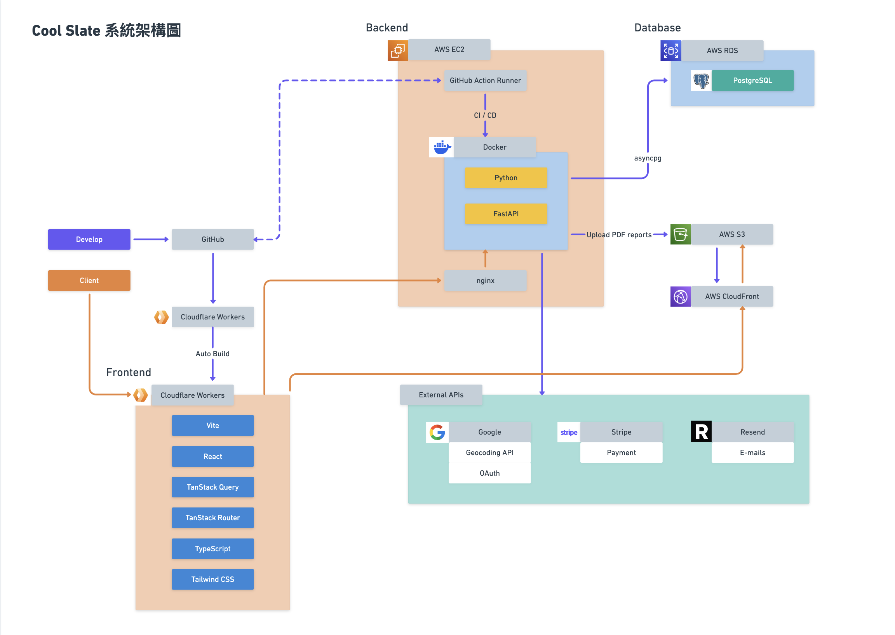

  

# Cool Slate - 智能冷氣服務預約平台

**線上體驗 Demo:** [https://cool-slate.ayating.workers.dev](https://cool-slate.ayating.workers.dev)

## 專案簡介

Cool Slate 是一個模擬真實業務規模的智能冷氣服務預約平台。設計初衷源於觀察到傳統冷氣業者普遍依賴電話人工預約，容易產生時段衝突、人力調度混亂等痛點。

本專案旨在解決此效率問題，透過將商家的**可用時段視覺化**，並引入**差異化排程策略**與**自動化訂單管理**，讓使用者可以無痛預約冷氣安裝、維修與保養服務。期望 Cool Slate 能成為使用者與冷氣商家之間，一座高效、透明的溝通橋樑。

## 我的角色

此專案由本人獨立開發，我負責了從 **需求分析、系統設計、前後端實作到雲端部署** 的完整開發流程。過程中特別著重在排程演算法的設計、資料庫並發控制，以及整合多個第三方服務的實務挑戰，藉此專案深度鍛鍊了全端開發與系統整合能力。

## 功能特色

- **📅 互動式預約日曆與表單：**

  - **動態時段顯示：** 前端日曆會根據不同服務類型，向後端請求並視覺化顯示未來數月內的可預約時段。
  - **即時人力檢核：** 當使用者在預約表單中更改「台數」時，前端會即時向後端 API (`/calendar/check-units`) 發送請求，驗證該時段人力是否充足，並在不足時給予友善提示與建議。
  - **動態預約表單：** 預約表單會根據服務類型（安裝／保養／維修）動態調整欄位，如「新機安裝」會出現商品選購列表。

- **🔐 端到端權限管理:**

  - **前端路由守衛：** 利用 **TanStack Router** 的 `beforeLoad` 功能，在頁面載入前檢查用戶角色。若權限不足（如一般用戶嘗試訪問 `/admin`），會立即重定向，提供快速明確的導航。
  - **後端 API 保護：** 每個需要授權的 API 端點都會通過 FastAPI 的依賴注入驗證請求中的 JWT，這是系統安全的最終防線，確保任何未經授權的請求都會在伺服器層級被嚴格阻擋。

- **🎛️ 多功能管理後台:**

  - **看板式工單追蹤：** 以「待排程」、「七日內」等看板分類未完工訂單，讓管理者一目了然掌握工作進度。
  - **訂單生命週期管理：** 管理員可執行手動排程、處理退款、批准訂單取消、標記完工等操作，所有狀態變更都會透過 **TanStack Query** 的快取失效機制（`invalidateQueries`）即時同步到介面上。
  - **檔案管理整合：** 支援上傳 PDF 完工報告至 S3，並能在後台直接預覽。
  - **會員與訂單總覽：** 提供完整的會員列表搜尋與訂單篩選功能，方便管理者查詢特定用戶的歷史訂單。

- **👤 綜合會員中心:**

  - **個人化儀表板：** 使用者可以清晰地看到自己的所有訂單狀態，包括「預約中」、「已排程」、「已結案」等，並能快速查看訂單詳情。
  - **自助服務流程：** 在符合條件下（如預約日期三天前），用戶可自行發起「取消訂單」的申請。未付款訂單也可直接在詳情頁中重新觸發付款流程。

- **⚙️ 自動化後端服務：**

  - **差異化排程策略：** 「安裝／保養」訂單付款後即時排程；「維修」訂單則由背景任務於每日下午 3:00 統一批次處理。
  - **自動化系統維護：** 透過 `asyncio` 背景任務，定期清理過期資源鎖與超時未付款訂單，確保系統資源健康。
  - **資源鎖定與防衝突：** 透過資料庫交易與**行級鎖 (Row-Level Lock)**，從根本上避免同一時段被重複預約。

- **💳 整合式金流與通知：**
  - **Stripe 安全支付：** 串接 Stripe 處理線上信用卡付款。
  - **Webhook 即時同步：** 付款成功後，透過 Webhook 自動更新訂單狀態並觸發後續排程。
  - **Resend 自動化郵件：** 自動寄送排程完成、取消的通知，並附帶**一鍵加入行事曆的連結**。

## 系統架構

## 技術棧

- **後端 (Backend):**

  - FastAPI + Python 3.13
  - PostgreSQL 17
  - asyncpg (非同步資料庫驅動)
  - `asyncio` (用於管理背景任務)
  - Docker

- **前端 (Frontend):**

  - React 19 + TypeScript
  - TanStack Router (檔案式路由與路由守衛)
  - TanStack Query (伺服器狀態管理)
  - Tailwind CSS
  - Vite

- **第三方服務 (3rd-Party Services):**
  - **支付：** Stripe
  - **認證：** Google OAuth 2.0
  - **地理：** Google Maps Geocoding
  - **郵件：** Resend
  - **儲存：** AWS S3 + CloudFront

## ✨ 技術亮點

### 後端與系統設計

- **非同步背景任務:** 活用 FastAPI 的 `lifespan` 與 `asyncio`，實現了自動清理與批次排程的常駐背景服務，提升了系統的穩定性與效率。
- **資料庫層級的進階應用:**
  - **並發控制:** 在高併發預約場景中，透過 PostgreSQL 的**行級鎖** (`SELECT ... FOR UPDATE`) 機制，從根本上解決了資源競爭問題，確保資料一致性。
  - **效能優化:** 將複雜查詢（如人力計算、地理距離）封裝為資料庫**自定義函數**，減少了應用程式與資料庫間的網路往返，有效提升 API 回應速度。
  - **自動化邏輯:** 利用**觸發器 (Triggers)** 自動化處理資料關聯操作，例如在訂單狀態變更時，同步釋放或更新相關資源，確保資料的完整性。
- **可靠的自動化部署:** CI/CD 流程中整合了**部署後健康檢查**，能自動驗證服務是否成功啟動，若失敗則輸出日誌，大幅加速問題排查。

### 前端架構

- **伺服器狀態管理:**

  - 大量採用 **TanStack Query** 來管理所有與後端相關的資料狀態，實現了智能快取、背景自動更新、請求重試等功能，大幅提升了數據一致性與使用者體驗。
  - 透過 `queryClient.invalidateQueries` 精準地控制快取失效，當用戶執行操作後，相關的數據能自動刷新，確保介面即時響應。

- **現代化路由方案:**

  - 使用 **TanStack Router** 實現了完全型別安全（Type-Safe）的檔案式路由。
  - 利用其 `beforeLoad` API 實現了非同步的路由守衛，優雅地處理了頁面權限驗證邏輯。

- **高內聚、低耦合的 Hooks:**

  - 將複雜的業務邏輯（如使用者認證、訂單預約）封裝在自定義 Hooks 中（`useAuth`, `useBooking`），使得元件（Component）的職責更單純，專注於 UI 呈現，提升了程式碼的可讀性與可維護性。

- **原子化與響應式設計:**
  - 採用 **Tailwind CSS** 進行樣式開發，實現了快速、一致的 UI 建構，並確保在各種裝置上都有良好的響應式表現。

## 架構概觀

本專案採用前後端分離架構，並整合多項雲端服務以模擬真實世界的應用場景：

1.  **使用者介面 (Frontend):** 使用者透過部署在 **Cloudflare Workers** 全球邊緣網路上的 **React** 應用程式進行互動。前端透過 **TanStack Query** 管理伺服器狀態，向後端發起 API 請求。

2.  **預約與支付流程:**

    - 使用者在前端選擇服務與時段，請求發送至部署在 **AWS EC2** 上的 **FastAPI** 後端。
    - 後端向 **AWS RDS (PostgreSQL)** 資料庫查詢可用人力，並暫時鎖定該時段。
    - 後端生成 **Stripe** 支付頁面，引導使用者完成付款，並透過 **Webhook** 即時同步狀態。

3.  **背景服務 (Background Services):**

    - FastAPI 應用程式啟動時，會透過其 **`lifespan` 管理器**，統一管理資源（如資料庫連線池、HTTP 客戶端）的生命週期，並啟動兩個常駐的背景任務：
      - **清理任務 (`cleanup_loop`):** 定期執行，自動清理過期的臨時鎖定與未付款訂單。
      - **維修排程任務 (`repair_scheduling_loop`):** 每日定時 (15:00) 啟動，批次處理待排程的維修訂單。

4.  **通知與報告:**

    - 排程確認後，系統透過 **Resend API** 發送郵件給使用者。
    - 服務完成後，管理員可上傳 PDF 完工報告至 **AWS S3**，檔案透過 **AWS CloudFront CDN** 加速分發。

5.  **自動化維運 (CI/CD):**
    - **前端自動部署:** 專案與 GitHub 儲存庫連結，當主分支更新時，自動觸發 **Cloudflare Workers** 進行建構與部署。
    - **後端持續整合與部署:**
      - 使用 **GitHub Actions CI/CD**，配合部署在 **AWS EC2** 上的 **Self-hosted Runner**，於程式碼變更時自動執行建構 Docker Image、推送與部署流程。
      - **部署後健康檢查：** 完成部署後，CI/CD 流程會發送 HTTP 請求至指定健康檢查端點（`/status`），若伺服器未在限定時間內回應成功狀態，將視為部署失敗並自動輸出容器日誌。此機制有助於快速偵錯並確保服務穩定上線。
